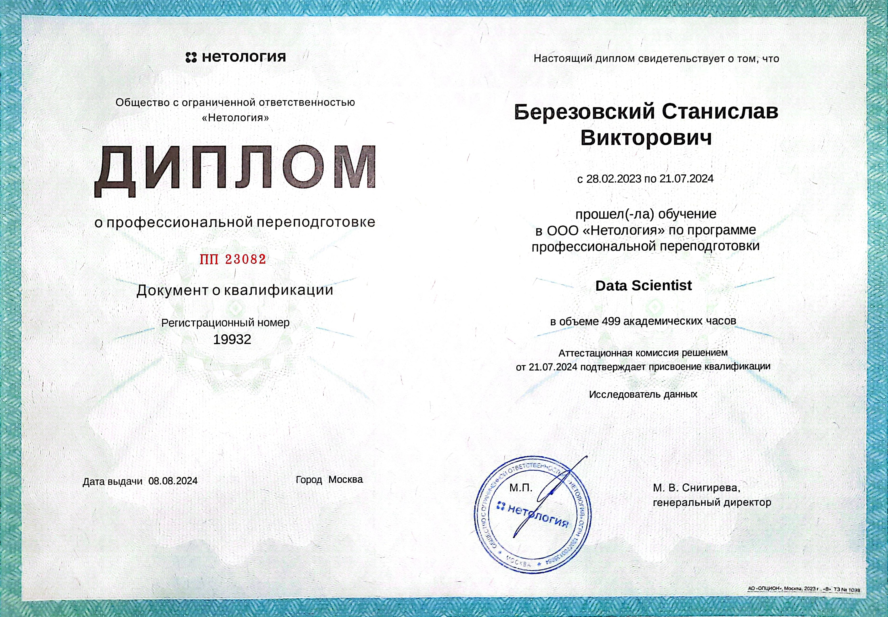

# Data Scientist

#### How to reach me

  
  
  

---

### Projects
1. [SQL](https://github.com/bersv/bersv.github.io/tree/main/Projects/01_SQL)
2. [Python statistics](https://github.com/bersv/bersv.github.io/tree/main/Projects/02_Python_statistics)
3. [Working with features and building models](https://github.com/bersv/bersv.github.io/tree/main/Projects/03_Working_with_features_and_building_models)
4. [Neural networks](https://github.com/bersv/bersv.github.io/tree/main/Projects/04_Neural_networks/Convolutional_NNs)
5. [Time series](https://github.com/bersv/bersv.github.io/tree/main/Projects/05_Time_series)
6. [Recommendation systems](https://github.com/bersv/bersv.github.io/tree/main/Projects/06_Recommendation_systems)
7. [Computer vision](https://github.com/bersv/bersv.github.io/tree/main/Projects/07_Computer_vision)
8. [Natural language processing](https://github.com/bersv/bersv.github.io/tree/main/Projects/08_Natural_language_processing)
10. [Test tasks](https://github.com/bersv/bersv.github.io/tree/main/Projects/09_Test_tasks)

### Certificates

  
  
  
  
  
  
  
  
  
  
  
  
  
  

---

### Skills

