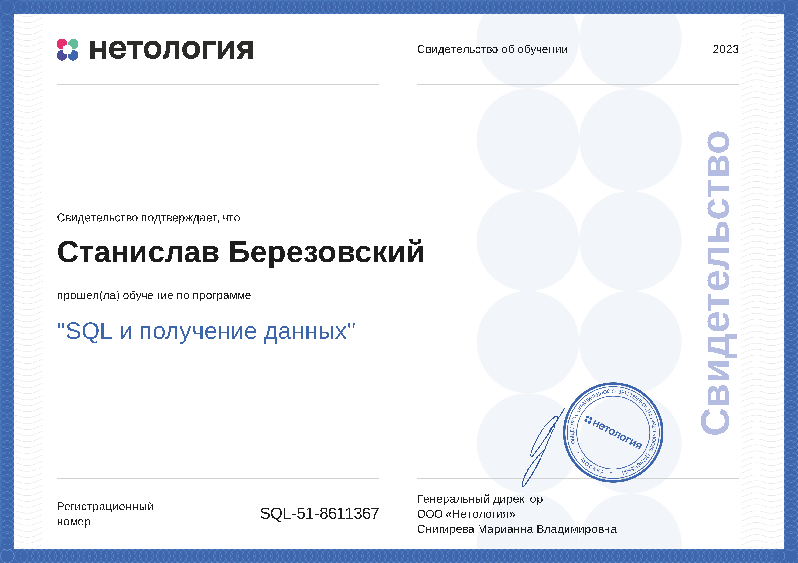
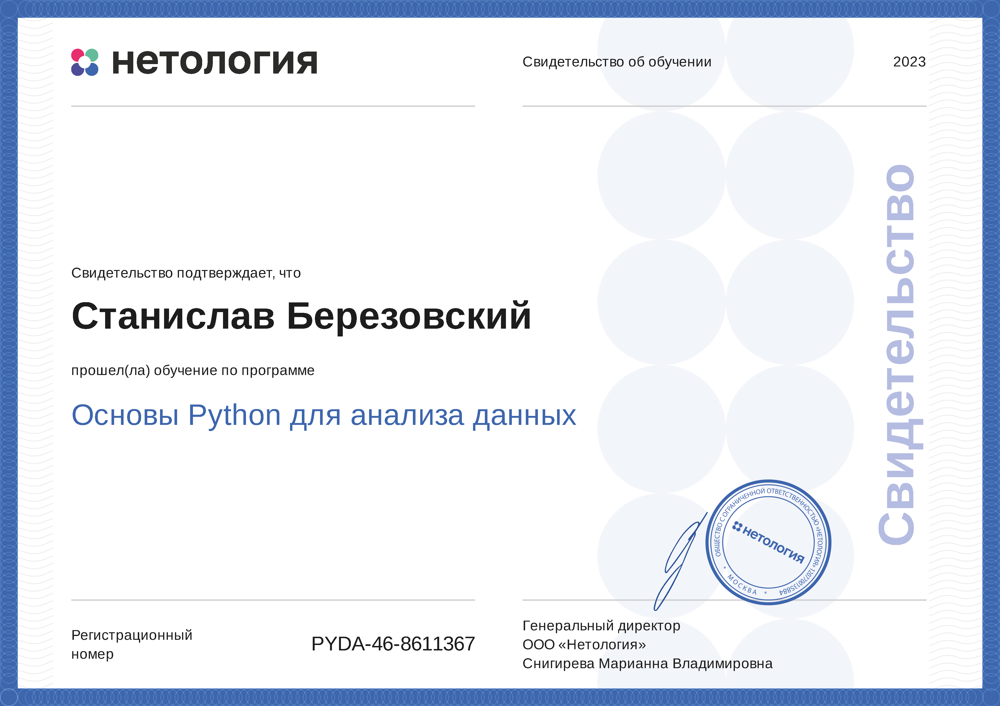
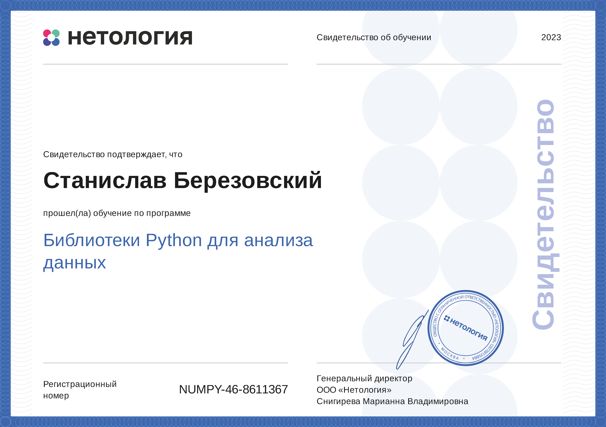
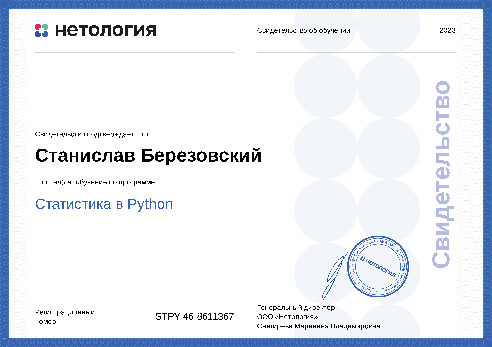
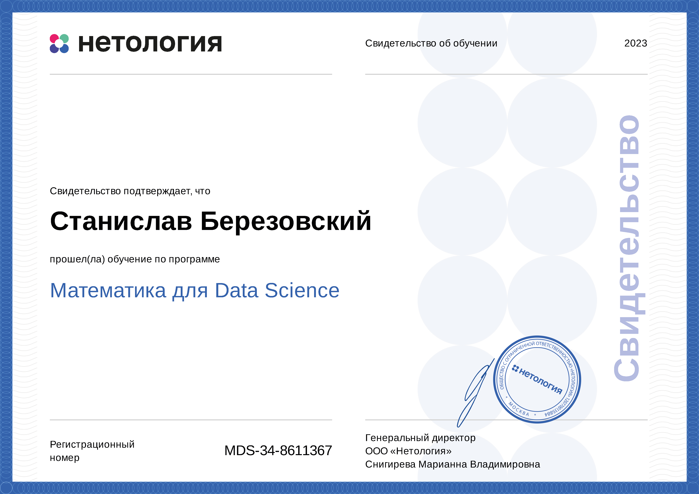
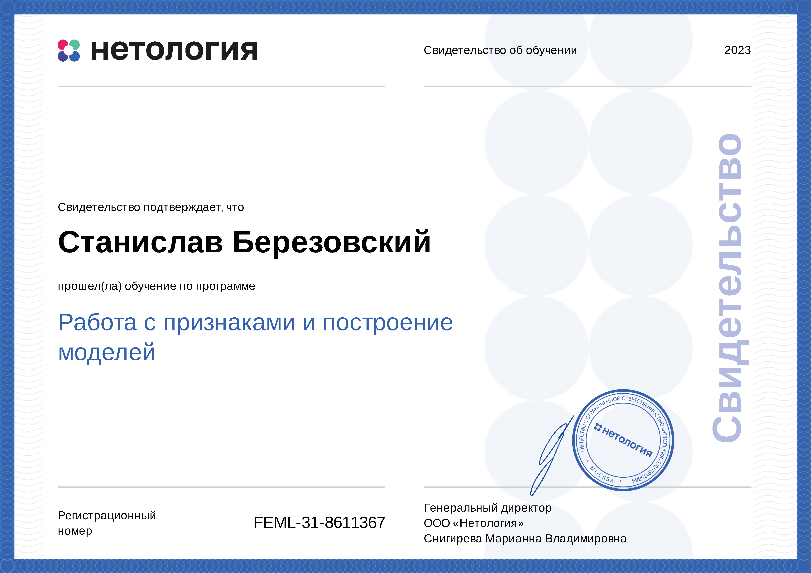
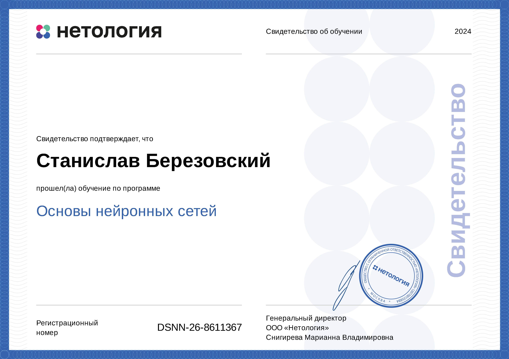
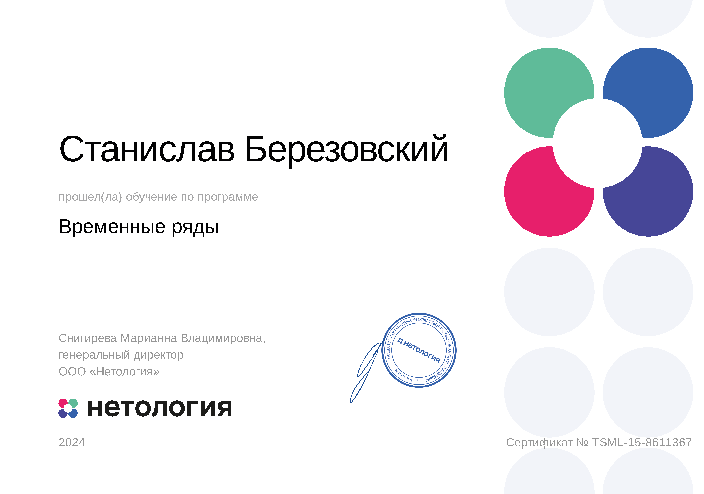
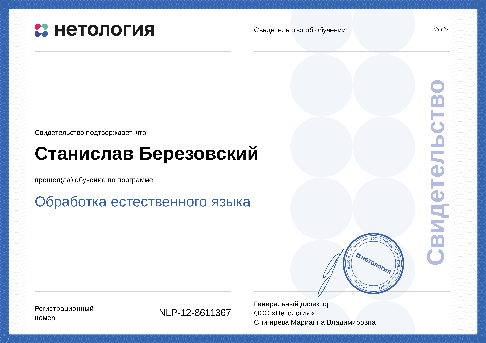
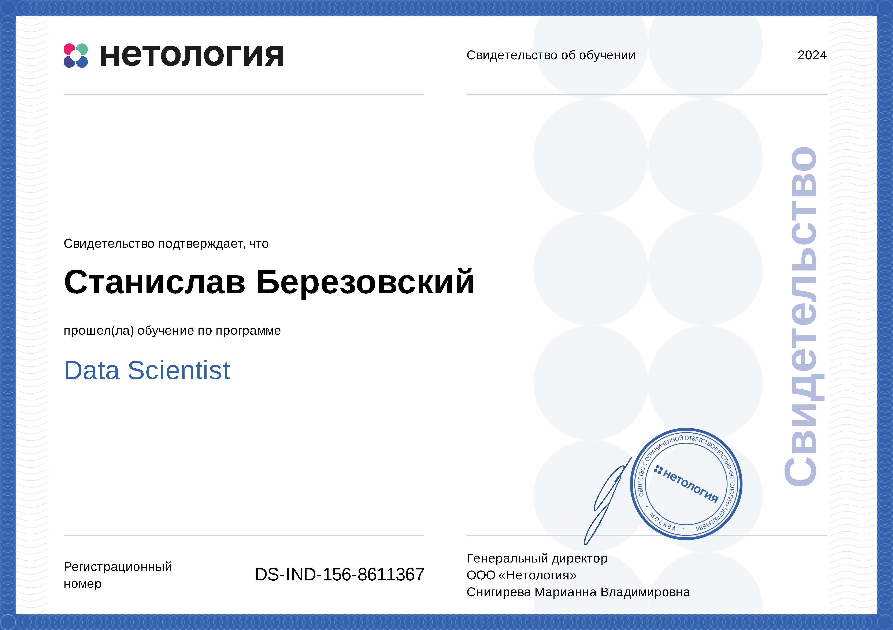

# Data Scientist

#### How to reach me
<!--

  

#EA4335
-->

  
  
  

---
<!--
### Education
 
### Work expirience-->

### Projects
1. [SQL](https://github.com/bersv/bersv.github.io/tree/main/Projects/01_SQL)
2. [Python statistics](https://github.com/bersv/bersv.github.io/tree/main/Projects/02_Python_statistics)
3. [Working with features and building models](https://github.com/bersv/bersv.github.io/tree/main/Projects/03_Working_with_features_and_building_models)
4. [Basics of neural networks](https://github.com/bersv/bersv.github.io/tree/main/Projects/04_Basics_of_neural_networks/Introduction_to_Convolutional_NNs)
5. [Time series](https://github.com/bersv/bersv.github.io/tree/main/Projects/05_Time_series)
6. [Recommendation systems](https://github.com/bersv/bersv.github.io/tree/main/Projects/06_Recommendation_systems)
7. [Computer vision](https://github.com/bersv/bersv.github.io/tree/main/Projects/07_Computer_vision)
8. [Natural language processing](https://github.com/bersv/bersv.github.io/tree/main/Projects/08_Natural_language_processing)
9. [Graduate work](https://github.com/bersv/bersv.github.io/tree/main/Projects/09_Graduate_work)
10. [Test tasks](https://github.com/bersv/bersv.github.io/tree/main/Projects/10_Test_tasks)

### Certificates

<html lang="en">
<head>
<meta charset="UTF-8">
<title>Image Hover Effect</title>

</head>
<body>
  

    
    
    
    
    
    
    
    
    
    
    
    
    
  

</body>
</html>

<!--
1. [SQL](Certificates/01_SQL.pdf)
2. [Python basics](Certificates/02_Python_basics.pdf)
3. [Python libraries for data analysis](Certificates/03_Python_libraries_for_data_analysis.pdf)
4. [Python statistics](Certificates/04_Python_statistics.pdf)
5. [Mathematics for data science](Certificates/05_Mathematics_for_data_science.pdf)
6. [Working with features and building models](Certificates/06_Working_with_features_and_building_models.pdf)
7. [Basics of neural networks](Certificates/07_Basics_of_neural_networks.pdf)
8. [Time series](Certificates/08_Time_series.pdf)
9. [Recommendation systems](Certificates/09_Recommendation_systems.pdf)
10. [Computer vision](Certificates/10_Computer_vision.pdf)
11. [Natural language processing](Certificates/11_Natural_language_processing.pdf)
12. [Data project management](Certificates/12_Data_project_management.pdf)
13. [Data scientist](Certificates/13_Data_scientist.pdf)-->

---

### Skills

<!--
 

  

-->

<!--

https://www.vectorlogo.zone/logos/python/python-icon.svg

 
  
  
  
  
  
  
  

-->
